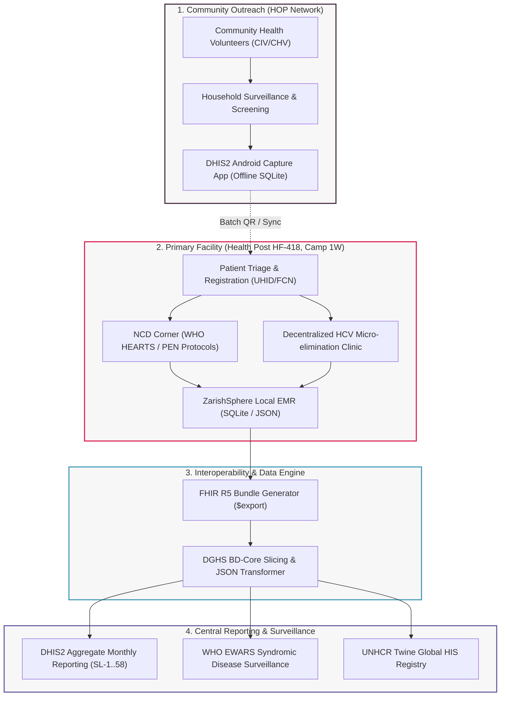

# CPI Bangladesh Mission Control — Resource Library & Technical Hub

<div class="cpi-hero">
  <div class="cpi-hero-badge">
    <span>CPI BANGLADESH MISSION CONTROL · ZERO-BUDGET OPEN STACK</span>
  </div>
  <div class="cpi-hero-title">
    Community Partners International <span>(CPI)</span>
  </div>
  <div class="cpi-hero-subtitle">
    Single Source of Truth (SSOT) public technical library for decentralized Hepatitis C (HCV), Cardiovascular Disease (CVD/NCD), WHO HEARTS protocols, Health Outreach Program (HOP) community surveillance, and primary healthcare registers at Health Post HF-418, Camp 1W, Ukhiya, Cox's Bazar.
  </div>
  <div style="font-style: italic; color: #D0C4C5; font-size: 0.95rem; margin-bottom: 1.2rem;">
    "Empower communities. Transform lives." — Founded 1998 · 501(c)(3) NGO
  </div>
  <div class="cpi-hero-actions">
    <a href="standards/" class="cpi-btn cpi-btn-primary">
      <span>Explore Clinical Standards</span> →
    </a>
    <a href="template-library/" class="cpi-btn cpi-btn-secondary">
      <span>Primary Care Register Catalog (SL-1..58)</span>
    </a>
    <a href="models/platform-blueprint/" class="cpi-btn cpi-btn-secondary">
      <span>System Architecture Blueprint</span>
    </a>
  </div>
</div>

---

## Program Impact & Operational Baselines

<div class="cpi-metrics-grid">
  <div class="cpi-metric-box">
    <div class="cpi-metric-val">97%</div>
    <div class="cpi-metric-lbl">Local Workforce Rate</div>
  </div>
  <div class="cpi-metric-box">
    <div class="cpi-metric-val">95%</div>
    <div class="cpi-metric-lbl">Direct Program Funding</div>
  </div>
  <div class="cpi-metric-box">
    <div class="cpi-metric-val">110+</div>
    <div class="cpi-metric-lbl">Reporting Health Posts</div>
  </div>
  <div class="cpi-metric-box">
    <div class="cpi-metric-val">0-Budget</div>
    <div class="cpi-metric-lbl">Google Workspace Stack</div>
  </div>
</div>

---

## Interactive Resource Navigation Hub

<div class="cpi-grid">
  <div class="cpi-card cpi-card-red">
    <div class="cpi-card-header">
      <h3 class="cpi-card-title">Adapted Clinical Standards</h3>
      <span style="font-size: 0.75rem; font-weight: bold; color: #D91E4D; background: rgba(217,30,77,0.1); padding: 2px 8px; border-radius: 4px;">FHIR R5 / WHO</span>
    </div>
    <p class="cpi-card-desc">
      HL7 FHIR R5 core profiles, Bangladesh DGHS BD-Core IG, WHO ICD-11 MMS linearization, LOINC laboratory codes, and DHIS2 data elements.
    </p>
    <a href="standards/" class="cpi-card-link">View Adapted Standards Catalog →</a>
  </div>

  <div class="cpi-card cpi-card-purple">
    <div class="cpi-card-header">
      <h3 class="cpi-card-title">Primary Care Register Catalog</h3>
      <span style="font-size: 0.75rem; font-weight: bold; color: #41273B; background: rgba(65,39,59,0.1); padding: 2px 8px; border-radius: 4px;">SL-1..58 Forms</span>
    </div>
    <p class="cpi-card-desc">
      Digitized registers, OPD tally sheets, EMR intake forms, HCV micro-elimination logs, and NCD corner protocols adapted for Camp 1W.
    </p>
    <a href="template-library/" class="cpi-card-link">Browse Register Templates →</a>
  </div>

  <div class="cpi-card cpi-card-blue">
    <div class="cpi-card-header">
      <h3 class="cpi-card-title">System Architecture Models</h3>
      <span style="font-size: 0.75rem; font-weight: bold; color: #4298B5; background: rgba(66,152,181,0.1); padding: 2px 8px; border-radius: 4px;">C4 & Blueprint</span>
    </div>
    <p class="cpi-card-desc">
      Platform architecture blueprints, C4 container models, ZarishSphere HIS data engine, FHIR server spikes, and diagram color semantics.
    </p>
    <a href="models/platform-blueprint/" class="cpi-card-link">Inspect Architecture Models →</a>
  </div>

  <div class="cpi-card cpi-card-sec">
    <div class="cpi-card-header">
      <h3 class="cpi-card-title">Master Terminology & Glossary</h3>
      <span style="font-size: 0.75rem; font-weight: bold; color: #615E9B; background: rgba(97,94,155,0.1); padding: 2px 8px; border-radius: 4px;">SNOMED / LOINC</span>
    </div>
    <p class="cpi-card-desc">
      Cross-walk index mapping local Bengali clinical terms, UNHCR Twine indicators, WHO PEN risk categories, and ICD-11 stem codes.
    </p>
    <a href="glossary/" class="cpi-card-link">Access Master Glossary →</a>
  </div>
</div>

---

## End-to-End System Architecture & Data Flow

Below is the complete, authoritative operational data flow connecting Community Health Volunteers (CIV/CHV/SRHV) in Camp 1W to Health Post HF-418, ZarishSphere HIS, and central DHIS2 / WHO EWARS platforms.



---

## Interoperability & Standards Compliance Matrix

All clinical observations, diagnoses, and lab results recorded at Health Post HF-418 strictly conform to international and national Bangladesh standards:

| Domain / Domain Area | Target Standard / IG | Primary Identifiers & Codings | Compliance Status |
|---|---|---|---|
| **Clinical Interoperability** | HL7 FHIR Core Specification R5 | `Package hl7.fhir.r5.core5` | **STU Certified** |
| **National Alignment** | BD-Core-FHIR IG (DGHS Bangladesh) | `NID`, `BRN`, `UHID`, `DGDA Drug Registry` | **v0.4.7 Synchronized** |
| **Disease Classification** | WHO ICD-11 MMS Linearization | `1E50.0` (Hepatitis C), `BA00` (Essential Hypertension) | **2026-01 Linearized** |
| **Laboratory & Vitals** | LOINC Terminology Standard v2.83 | `8480-6` (Systolic BP), `1558-6` (Fasting Glucose) | **August 2026 Release** |
| **Aggregate Health Reporting** | DHIS2 Core Platform v2.43.1 | Data Elements: `DE_HCV_SCREENED`, `DE_NCD_HYPERTENSION` | **v43 Active** |
| **Refugee Health Indicators** | UNHCR Twine Global HIS | OPD Morbidity, Under-5 Mortality, Consultation Rate | **Quarterly Aligned** |
| **Crisis Minimum Standards** | Sphere Handbook 2026 Edition | Emergency Health Action, Cholera Alert Threshold (1 case) | **100% Compliant** |

---

## Three Core Program Pillars

### 1. Health — Decentralized HCV & NCD Care
CPI operates a pioneer decentralized model at Health Post HF-418 (Camp 1W, Ukhiya), bringing rapid Hepatitis C screening, confirmatory GeneXpert RNA testing, direct-acting antiviral (DAA) treatment, and WHO HEARTS protocol cardiovascular risk management directly to Rohingya refugees and host communities.

### 2. Humanitarian Relief — Emergency Response
Compliance with Sphere minimum standards in disaster response. Immediate epidemic outbreak detection (cholera, measles, acute watery diarrhea) integrated directly with WHO EWARS daily reporting.

### 3. Well-Being — Community Outreach (HOP)
Health Outreach Program (HOP) network comprising Community Health Volunteers (CIV/CHV/SRHV) conducting door-to-door household surveillance, treatment adherence counseling, and referral tracking using offline mobile devices.

---

## Document & Artifact Naming Standard (ZUSS)

All generated artifacts, registers, and code packages in this repository strictly adhere to the ZarishSphere Universal Serialization Standard (ZUSS):

```bash
CPI-BGD-{ProgramCode}-{DocumentType}-{YYYYMM}-v{Version}.{ext}
```

- **Example 1**: `CPI-BGD-HCV-SOP-202609-v1.0.pdf` (Decentralized HCV Screening SOP)
- **Example 2**: `CPI-BGD-NCD-REGISTER-202609-v2.1.xlsx` (NCD Corner Primary Care Register)
- **Example 3**: `CPI-BGD-FHIR-PROFILE-202609-v0.4.7.json` (DGHS BD-Core Patient Profile)

---

## Next Steps for Field Program Managers & Developers

!!! note "Step-by-Step Implementation Protocol"
    1. **Inspect Clinical Standards**: Review adapted profiles in the [Standards Directory](standards/).
    2. **Deploy Primary Care Registers**: Download or adapt [Register Templates (SL-1..58)](template-library/).
    3. **Set Up Mobile Outreach**: Configure offline field collectors with the [DHIS2 Android Capture Guide](standards/dhis2.md).
    4. **Verify Indicator Pipeline**: Test data integrity using `python3 scripts/validate_hub.py`.

---

## Governance, Safety & Zero-Budget Commitment

- **Operator**: Mohammad Ariful Islam — Health Program Manager, CPI Bangladesh Mission, Cox's Bazar.
- **Zero-Budget Guarantee**: Built 100% on free tiers (Google Workspace Nonprofit, GitHub Actions, OpenCode Zen Free Models, Vite/React SPA).
- **Patient Data Safeguard**: Zero PII committed. All public documentation, schemas, and examples use synthetic anonymized identifiers.

---

*Copyright © 1998–2026 Community Partners International (CPI) · All Rights Reserved · Licensed under CC BY 4.0 International.*  
*Official Contact: `ariful@cpi-ypsa.org` · Web: [www.cpintl.org](https://www.cpintl.org)*
