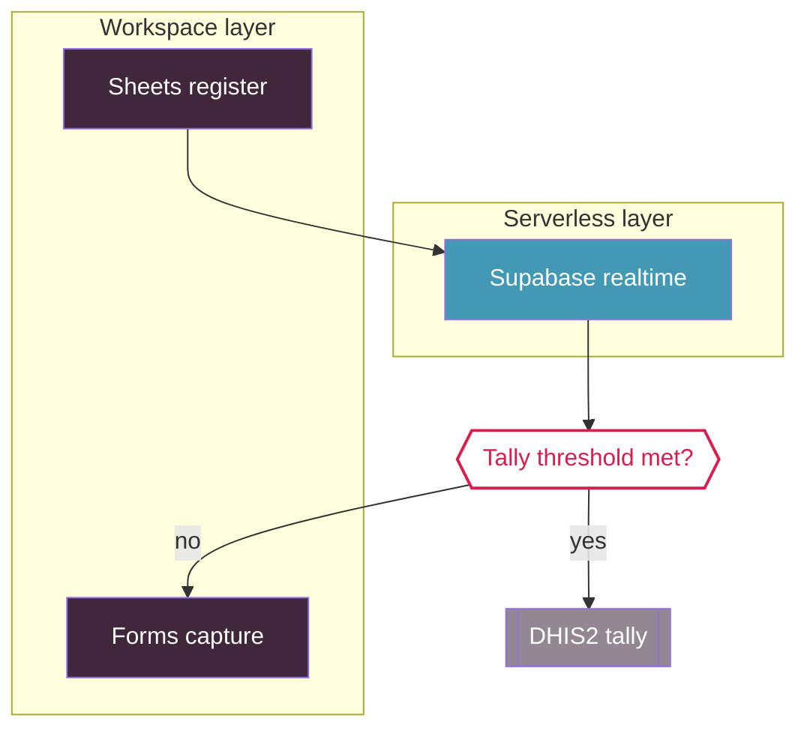

# Diagram color semantics

## Node color map

| Diagram element | Color | Brand hex | Legend label to show |
|---|---|---|---|
| Google Workspace / hub layer (L1) | CPI Purple | `#41273B` | `Workspace layer` |
| Free serverless layer (L2) | CPI Teal | `#4298B5` | `Serverless layer` |
| Data stores / registers | CPI Red | `#D91E4D` | `Data / register` |
| Actors / roles (CHW, nurse, MEAL) | CPI Purple Secondary | `#615E9B` | `Actor / role` |
| Output / deliverable (report, plan) | CPI Purple Secondary | `#615E9B` | `Output / deliverable` |
| External systems (DHIS2, YPSA, WHO, UNHCR) | CPI Mid Grey | `#948794` | `External system` |
| Decision / branch | CPI Red accent on `#FFFFFF` fill | `#D91E4D` | `Decision` |
| Source / input (paper, raw material) | CPI Light Grey | `#D0C4C5` | `Source / input` |
| Neutral / default node | CPI Light Grey | `#D0C4C5` | `Neutral` |

## Mandatory legend rule

Every diagram ends with a legend block that maps color → meaning. Because color is never the
only signal (WCAG 2.1 AA), the legend renders the color swatch AND the text label; node labels in
the diagram body are always meaningful text, never color alone.

## Examples

### Mermaid (fenced with ` ```mermaid `)



Legend: `#41273B` Workspace layer · `#4298B5` Serverless layer · `#D91E4D` Data/register ·
`#615E9B` Actor/role · `#948794` External system · `#D91E4D`-stroke Decision.

### PlantUML (fenced with ` ```plantuml `)

```plantuml
@startuml
skinparam nodeBackgroundColor #D91E4D
skinparam nodeFontColor #FFFFFF
@enduml
```

### Graphviz (fenced with ` ```dot `)


## Non-negotiables

1. Never substitute colors outside `cpi-bgd-branding/core/colors.json`.
2. Never convey meaning by color alone.
3. Pick the fill/text pair that keeps WCAG 2.1 AA contrast: white text on `#41273B`, `#D91E4D`,
   `#615E9B`, `#4298B5`, `#948794`; CPI Black `#2D2926` text on `#D0C4C5` and `#FFFFFF`.
4. Use exactly one semantic row per node; if two labels apply, choose the more specific row
   (`Output / deliverable` for a report/plan node, `Source / input` for a paper/material node).
5. Chart sequences (multiple data series) follow the brand chart order: `#D91E4D` → `#41273B`
   → `#4298B5` → `#615E9B` → `#948794` → `#D0C4C5`.

---

_This document: CC BY 4.0. Community Partners International (CPI). Visit www.cpintl.org._