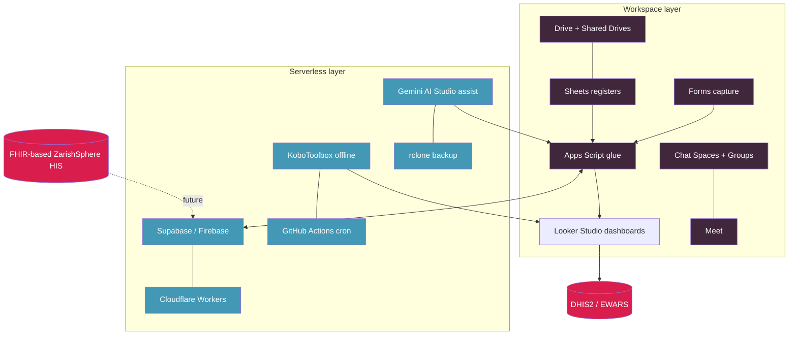
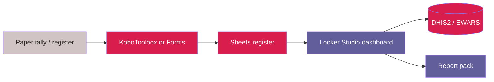

# Platform blueprint

## Architecture (as decided 2026-09-07)

Legend: `#41273B` Workspace layer · `#4298B5` Serverless layer · `#D91E4D` Data/register ·
`#948794` External system.

## The nine domains and their free tool mapping

| # | Domain | Now (Google-native) | Scale to (free serverless / relational) |
|---|---|---|---|
| 1 | Program operations | Sheets registers + Forms | Grist-style relational (serverless) |
| 2 | Program development | Docs + Sites + Gemini AI Studio | GitHub org per program |
| 3 | Realtime monitoring | Forms/Kobo → staging → aggregate → Looker (pipeline built in Phase 2) | Supabase/Firebase realtime |
| 4 | Staff management | Directory + Groups + Sheets register (built in Phase 2) | Serverless HR module |
| 5 | Grant management (full lifecycle) | Grant workbook (Pipeline/Budget/Deliverables/Compliance/Donor Reports) + Apps Script + Looker — replaces Monday.com | Relational grant DB |
| 6 | Reporting | Report calendar + scheduled assembler (built in Phase 2) + Looker | Scheduled Workers / Actions |
| 7 | Collaboration | Chat Spaces + Drive + Meet | — |
| 8 | Team management | Groups + Shared Drives + Spaces | — |
| 9 | Warehouse / inventory | Stock cards: item master + movements + low-stock/expiry alerts (built in Phase 2) | Relational inventory on serverless |

## Data-flow spine (tally → aggregate → report)

Legend: `#D0C4C5` Source / input · `#D91E4D` Data / register · `#615E9B` Output / deliverable.

## Scalability swap-points

| Today | Symptom it scales past | Swap to |
|---|---|---|
| Sheets register | concurrent writers / locked cells / 10M-cell limits | Supabase Postgres (free 500 MB) |
| Apps Script cron | 6 min runtime / 100k fetches per day | GitHub Actions (2,000 min/mo private) |
| Forms polling | need offline + validation | KoboToolbox (25k sub/mo free) |
| Manual report assembly | recurring every month | workflow in Sheets + Looker + Docs |
| Monday.com CPMS | — (paid, replaced) | Phase 1 grant workbook: Pipeline/Budget/Deliverables/Compliance/Donor Reports |
| ActivityInfo 4W | — (paid, being replaced) | Sheets + Forms + Looker 4W matrix |

## Rollout phases

- Phase 0 — Resource Hub foundation (this repo + public Pages site). STATUS: complete (v0.1.0).
- Phase 1 — Grant management, full lifecycle (template + scripts + migration manifest designed;
  operator builds/deploys the workbook). STATUS: design complete, deployment pending.
- Phase 2 — Operations domains (staff, warehouse, monitoring, reporting templates designed;
  operator builds the workbooks). STATUS: in progress.
- Phase 3 — ZarishSphere FHIR R5 HIS (design: blueprint + resource map + camp terminology done;
  ingestion bridge + profiles next). STATUS: in progress.

See `docs/rollout-plan.md` for the live progress tracker and
`models/zarishsphere-blueprint.md` for the HIS architecture.

---

_This document: CC BY 4.0. Community Partners International (CPI). Visit www.cpintl.org._